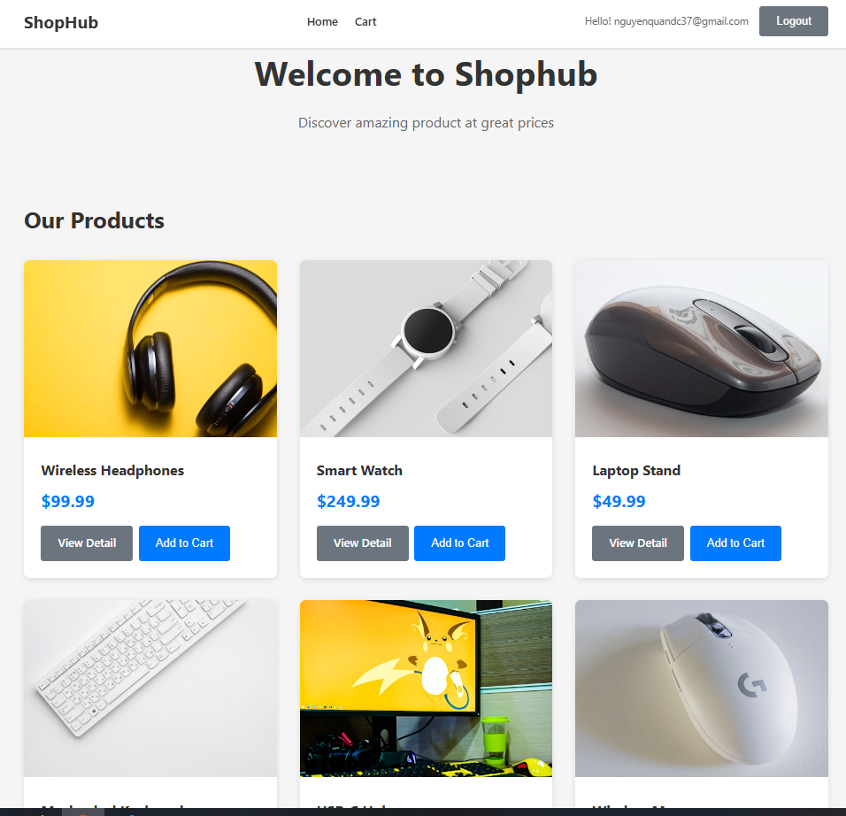
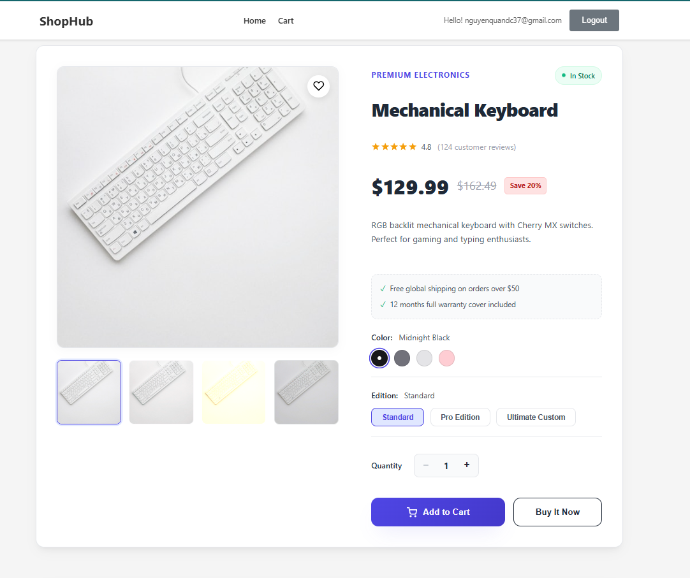

# ShopHub — Premium React E-Commerce Application

ShopHub is a state-of-the-art client-side e-commerce web application built on **React 19** and **Vite 8**. The application features user authentication with local session persistence, a responsive product grid, a highly interactive product customization detail view, and custom-designed micro-animations.

## 📸 Screenshots

| Home Page | Product Detail Page |
| :---: | :---: |
|  |  |

---

## 🌟 Core Features

### 1. Advanced Product Detail View
The product detail interface (`/product/:id`) delivers a premium shopping experience:
* **Interactive Image Gallery**: Features smooth magnification zoom-on-hover effects alongside a mock multi-thumbnail gallery simulating various image filters and color accents.
* **Togglable Wishlist**: A scale-animated "Heart" button with instant state toggle and glowing micro-effects.
* **Product Customizers**: Custom concentric ring color pickers and interactive edition pill selectors.
* **Quantity Controls**: Integrated increment and decrement controllers bounded between `1` and `99`.
* **Animated Success Toast**: A floating notification slides in smoothly from the corner upon clicking "Add to Cart" to provide positive visual confirmation.
* **Tabbed Information Pane**: Tab-switching interface for Specs & Details, Shipping & Returns, and mock user Reviews.
* **Recommended Items**: A "You May Also Like" recommended items grid at the bottom that scrolls up smoothly when clicking an item.

### 2. User Authentication
A full client-side registration system inside `/auth`:
* **Forms & Validations**: Field checks managed seamlessly via `react-hook-form` (validates length, email formats, and requirements).
* **Mode Swapping**: Quick toggle between Sign Up and Login layouts.
* **LocalStorage Session Storage**: Saves user registration credentials and login sessions, updating the navbar greeting and logout controls in real-time.

### 3. Home Grid & Navigation
* **Hero Banner**: Engaging welcome banner introducing the catalog.
* **Product Cards**: Sleek hover translation effects, high-fidelity images, pricing details, and quick links leading to detail views.
* **Sticky Navbar**: Header sticking to the top with site branding, responsive links, and live authentication greetings.

---

## 🛠️ Technology Stack

* **Core Library**: [React 19](https://react.dev/)
* **Bundler & Server**: [Vite 8](https://vite.dev/)
* **Routing**: [React Router Dom 7](https://reactrouter.com/)
* **Form Handling**: [React Hook Form 7](https://react-hook-form.com/)
* **Styling**: Vanilla CSS utilizing custom properties/variables, flexbox, CSS grid, and CSS `@keyframes` animations.

---

## 📂 Project Architecture

```bash
src/
├── assets/         # Project images and SVG logos
├── components/     # Globally reusable UI components
│   ├── NavBar.jsx      # Navigation header with auth state integration
│   └── ProductCard.jsx # Grid card with image, price, and details link
├── context/        # React Context stores
│   └── AuthContext.jsx # Handles local signup, login, session states
├── data/           # Mock data files
│   └── products.js     # Static e-commerce product database & query functions
├── pages/          # Router page containers
│   ├── Auth.jsx        # Signup / Login page
│   ├── Checkout.jsx    # Cart / Checkout preview (Stub)
│   ├── Home.jsx        # Landing page with hero & products grid
│   ├── ProductDetail.jsx   # Premium details, specs, and variants page
│   └── ProductDetail.css   # Self-contained detail page custom animations & styles
├── App.jsx         # Root router routing config
├── App.css         # Global e-commerce layout classes
└── main.jsx        # App mounting point
```

---

## 🚀 Installation & Setup

Follow these simple instructions to launch the application locally on your machine:

### 1. Prerequisites
Ensure you have [Node.js](https://nodejs.org/) installed (version 18+ is recommended).

### 2. Install Dependencies
Clone the repository, navigate into the project directory, and run the npm installer:
```bash
npm install
```

### 3. Run Development Server
Start the local server with hot module replacement (HMR) enabled:
```bash
npm run dev
```
Open [http://localhost:5173](http://localhost:5173) in your web browser to view the live app.

### 4. Build for Production
Generate the optimized build files:
```bash
npm run build
```
You can preview the production bundle locally with:
```bash
npm run preview
```
